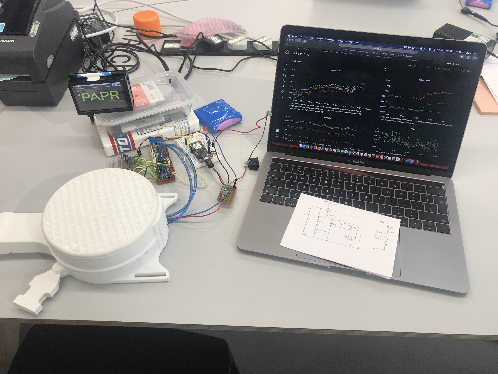
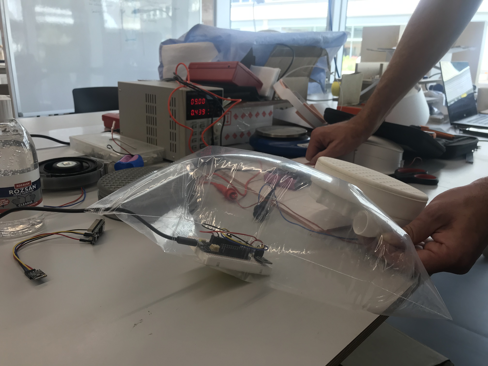
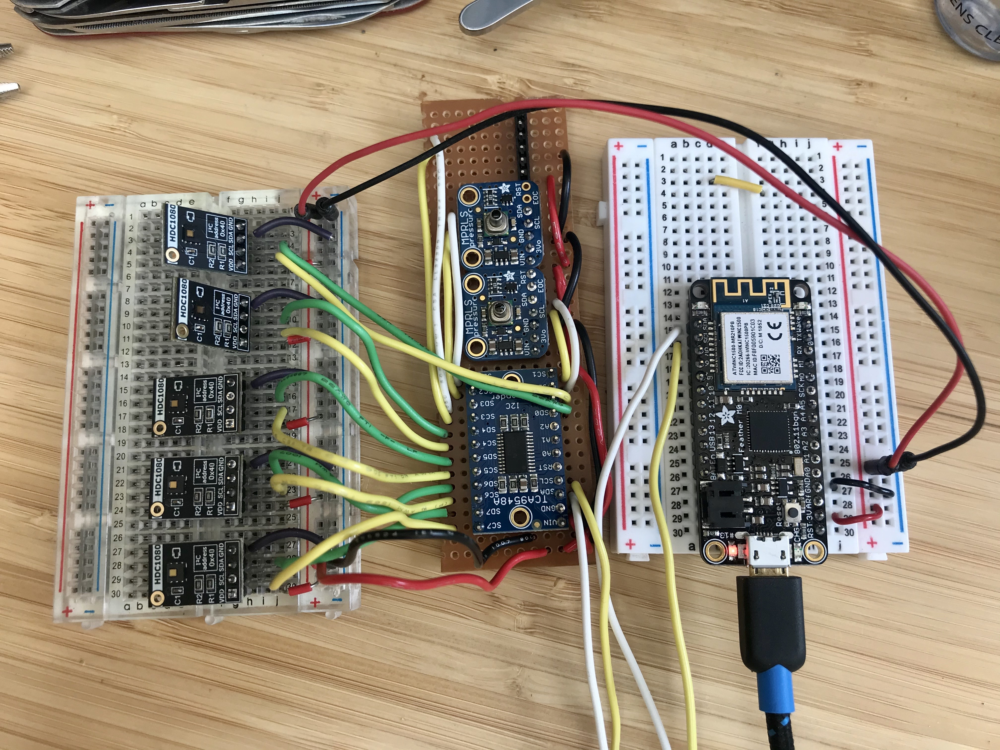
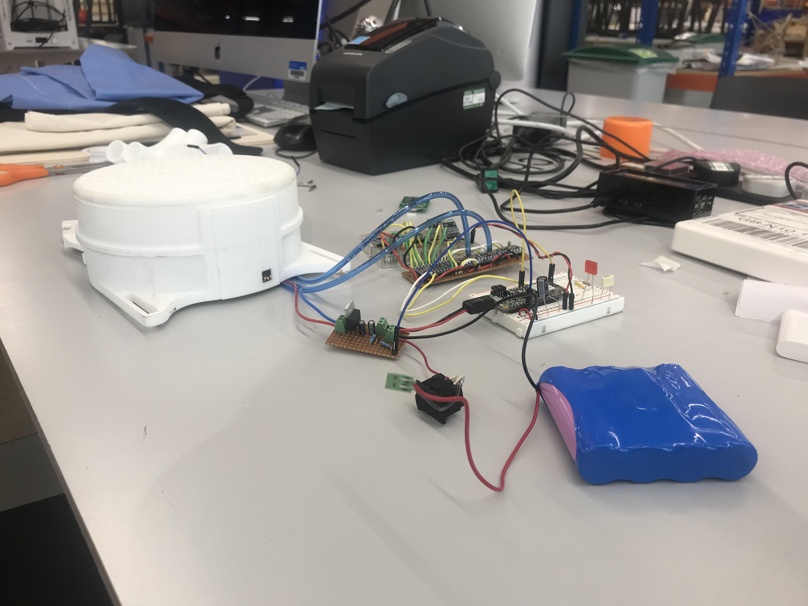
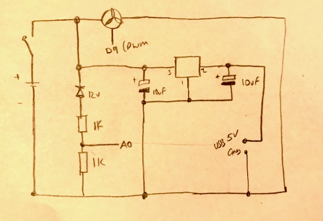
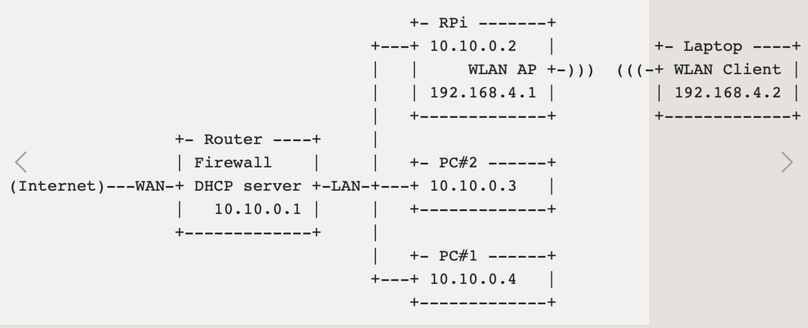
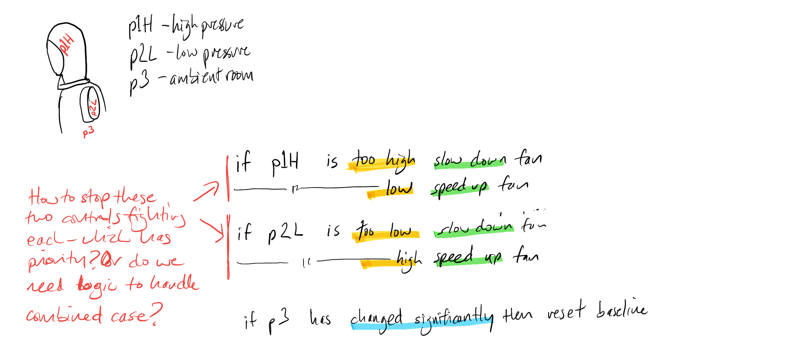

# Bartlett PAPR Project 2020

The [Powered Air Purified Respirator](https://en.wikipedia.org/wiki/Powered_air-purifying_respirator) (PAPR) project was a cross UCL Covid project led by Peter Scully in Bartlett BMade. This repo contains info on how we prototyped the sensor system to monitor air pressure in the respirator and temperature on the body / around the face to monitor performance and comfort factors.

Repo includes:
- code for capturing environment data
- overview of setting up data store and MQTT server
- schematics for controllers

## Code

```M0_papr_data``` is the latest demo version running the Arduino code to capture data from 5 HDC1080 temperature sensors and 3 MRPLS pressure sensors. 

```old_protos``` contains the various protos built leading up to this (we tried using LightBlueBeans and other bluetooth temp sensors to remove wired constraints but end design of PAPR didn't necessitate wireless sensors on the body)

```fancontrol``` contains a sketch with logic on how the fan was going to be controlled based on pressure and temp inputs

```pi``` contains the config file for telegraf which was used to parse data from the MQTT server on the RPi into an InfluxDB datastore on the RPi

## Hardware

The system had the following building blocks:

1. Main sensing unit to be attached to back worn fan unit
    - Adafruit Feather M0
    - 3x Adafruit MPRLS 
    - 5 Closed Cube HDC1080 temp / hum I2C sensor
    - TCA9548A multiplexer 
    - Circuit to step down voltage from fan powersource (14.8V) to Arduino (5V)

2. Raspberry Pi 4 
    - Acting as access point / gateway for Feather M0 (comms over wifi)
    - MQTT server as broker for sensor data
    - Telegraf and InfluxDB to parse data into datastore
    - Grafana for realtime visualisation of data

### Images below shows the component parts

All parts with Grafana display in web browser via RPi



Pressure Test



Testing Multiplexer



Powered by Fan Battery:




Power circuit sketch (14.8V battery for fan and 5V USB connection for arduino)




## Configuring RPi

Standard Raspbian build on RPi 4

### AP setup

Setting up RPI as a routed wireless access point [followed these instructions](https://www.raspberrypi.org/documentation/configuration/wireless/access-point-routed.md)



Using instructions above setup:
- LAN addresses are in 192.168.1.* range (not 10.10)
- WLAN from PI will be on 192.168.10.* (not 192.168.4)
- make sure device is plugged into ethernet LAN for setup.

### MQTT set up

sudo apt update
sudo apt install -y mosquitto mosquitto-clients
sudo systemctl enable mosquitto.service
mosquitto -v

192.168.10.1:1883

### TIG Stack

Followed general instructions for setting up Telegraf InfluxDB and Grafana on RPi - the telegraf config file is on ```pi``` folder.


<hr>

Tips:

Setting date on RPi when no network connection:
sudo date -s "Fri Jul 23 09:20:00 UTC 2020” 

<hr>

Todo:

Note - would be useful to set PWM for fan to zero at start up to give some time between switching circuit on and fan starting.



