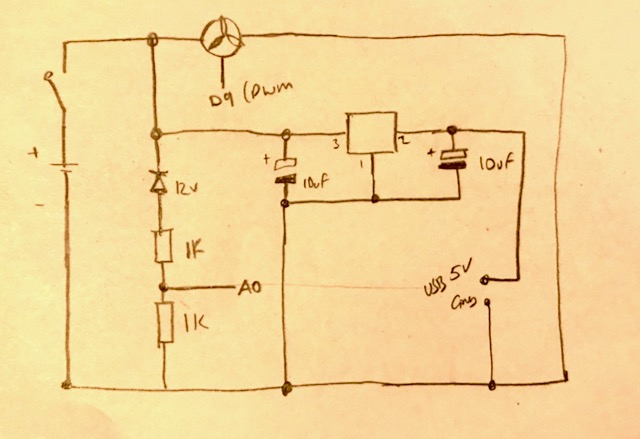

# papr
Bartlett PAPR Project 2020

Repo includes:
- code for capturing environment data
- overview of setting up data store and MQTT server
- schematics for controllers

# Work in Progress

M0_papr_data is the latest demo version running. 

Power circuit (14.8V battery for fan and 5V USB connection for arduino) sketch below

Note - would be useful to set PWM for fan to zero at start up to give some time between switching circuit on and fan starting.
